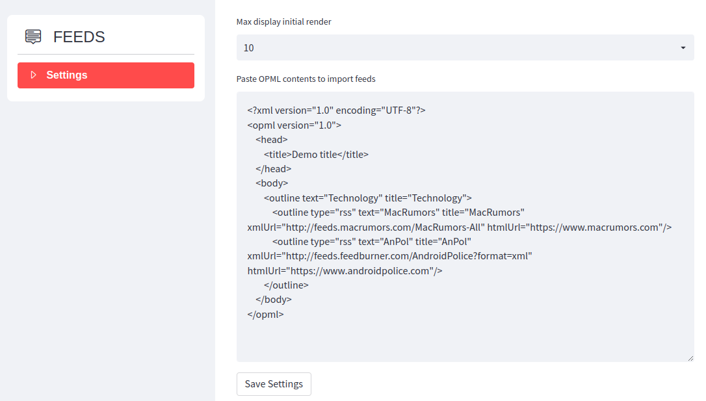
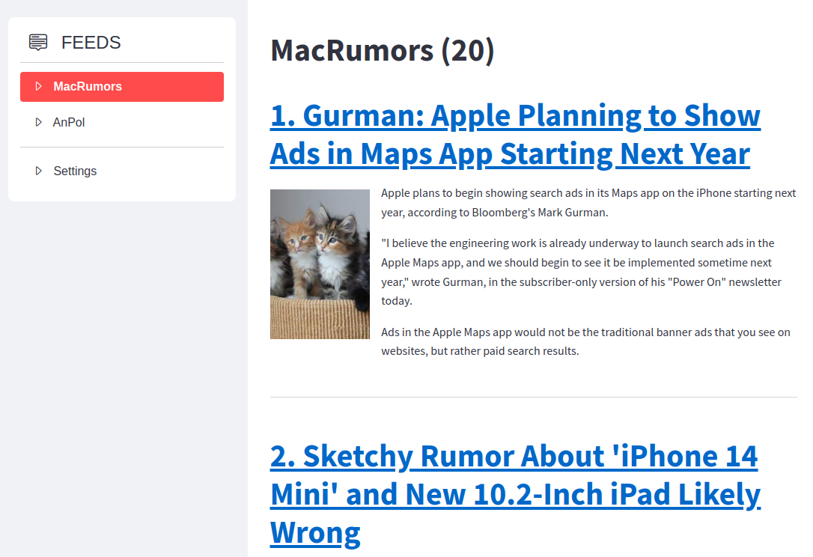

## Streamlit RSS Reader

# Introduction
  Proof of concept `rss feed reader`. This demo app is built using 
  * python (and the below modules)
	  * `streamlit`
		  * `streamlit-option-menu`
	  * `feedparser`
	  * `opml`
	  * `beautifulsoup4`

# Screenshots

## Landing Page

## Feed Page

# TODO Items

- [x] Implement Feed/ FeedItem model
- [x] Implement component to render `feed item`
- [x] Bootstrap model with `streamlit` view
- [x] Import feeds through OPML file
- [x] Limit feed render to the value in `settings`
- [x] `Load More` feed Items if available
- [x] Fix empty landing page
- [x] Break up `runner.py` implementation
	- [x] Move `settings` to own namespace
	- [x] Move `feed` and `feed item` helper methods to their respective namespaces
- [ ] Bugs
	- [x] Dangling icon once the feed is imported
	- [x] `Load More` feed items bug
- [ ] Add logging
- [ ] Fetch image url from the feed
- [ ] Read/Unread Tracker
- [ ] Periodically fetch items
- [ ] Add metadata for `feed item`. e.g. `last updated`, `author`, etc, (if available)
- [ ] Display progress when fetching items
- [ ] Implement 
- [ ] Persist user session data
	- [ ] Implent login
	- [ ] Integrate with with a `db`

The MIT License (MIT)
=====================

Copyright © `2022` `Akash Patki`

Permission is hereby granted, free of charge, to any person
obtaining a copy of this software and associated documentation
files (the “Software”), to deal in the Software without
restriction, including without limitation the rights to use,
copy, modify, merge, publish, distribute, sublicense, and/or sell
copies of the Software, and to permit persons to whom the
Software is furnished to do so, subject to the following
conditions:

The above copyright notice and this permission notice shall be
included in all copies or substantial portions of the Software.

THE SOFTWARE IS PROVIDED “AS IS”, WITHOUT WARRANTY OF ANY KIND,
EXPRESS OR IMPLIED, INCLUDING BUT NOT LIMITED TO THE WARRANTIES
OF MERCHANTABILITY, FITNESS FOR A PARTICULAR PURPOSE AND
NONINFRINGEMENT. IN NO EVENT SHALL THE AUTHORS OR COPYRIGHT
HOLDERS BE LIABLE FOR ANY CLAIM, DAMAGES OR OTHER LIABILITY,
WHETHER IN AN ACTION OF CONTRACT, TORT OR OTHERWISE, ARISING
FROM, OUT OF OR IN CONNECTION WITH THE SOFTWARE OR THE USE OR
OTHER DEALINGS IN THE SOFTWARE.
